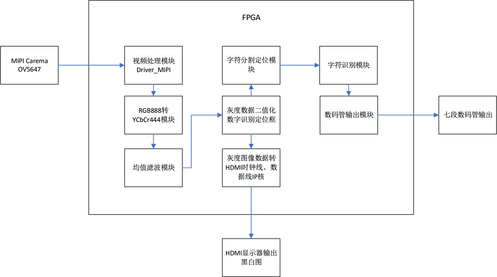
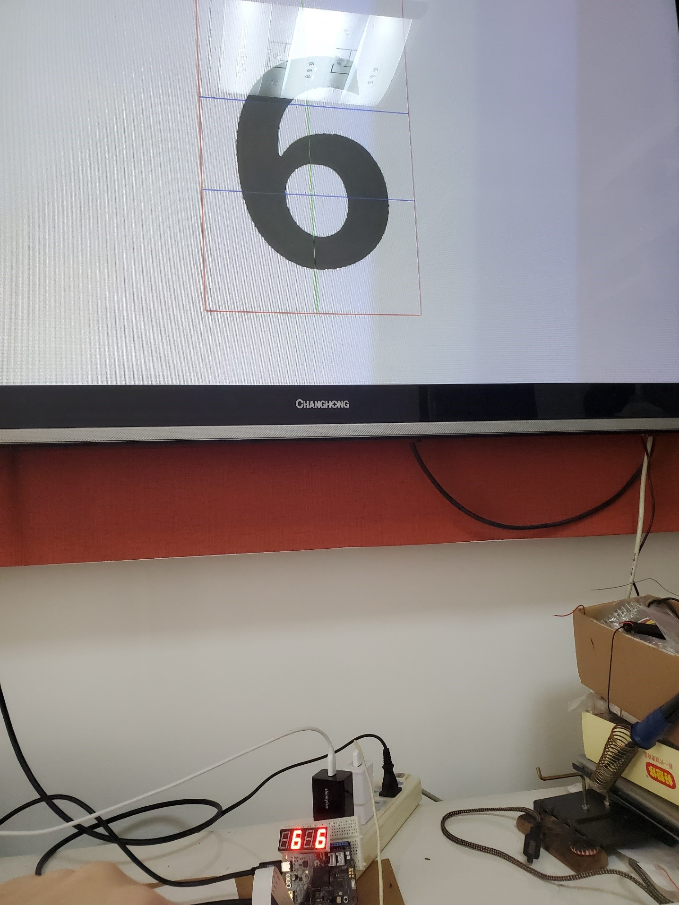

# 2020新工科联盟-Xilinx暑期学校(Sunmer School)
## A06_数字识别项目
---
### 项目概要 
1. 项目设计目的  
   
随着智能城市的发展，智能化的需求变得越来越强烈，智能家居、智能机器人、智能识别应运而生，特别是近几年智能识别技术迅速发展，智能识别可以应用在方面，如识别车牌以控制车辆进出或采集车流量信息；识别企业工作人员来签到、打卡，防止外来人员进入等等。


本项目现阶段拟通过摄像头采集图像，使用FPGA读取图像数据进行处理，根据不同数字的特征，对0-9十个数字进行处理，并在数码管上显示出读取到的数字信息。本项目以最简单的0-9十个数字实现FPGA的自动数字识别，其理论价值巨大。由于数字识别的类别墅较少，有助于做深入分析及验证一些新的理论。如人工神经网络(ANN)，相当一部分的ANN模型和算法都以手写数字识别作为具体的实验平台，验证理论的有效性，评价各种方法的优缺点。


随着项目的继续跟进，其发展的前景很广，通过将数字推广到英文字母、汉字、符号，可以使FPGA进行很多符号的识别，同时将识别范围进一步推广到物体的特征或将识别来的信息再通过一个算法，将有希望使FPGA能够进行图像、物体的识别，这将对于智能化识别的发展和推广有极大的促进作用。 

2. 项目应用场景及项目扩展

    - 号码识别：单纯数字识别最典型的应用场景就是可以对运动员号码薄进行识别，以此来实时查看每个运动员的位置、状况，以便成绩的备案与检录，减少人为因素造成的错误。同时还可以对电话号码薄进行识别，以此快速找到所需要的号码。
    - 车牌识别：可以识别车牌号码、类型、颜色、车标等车辆特征信息，以此可以控制小区、公司等的车辆的进出，同时还可以采集道路上的车流量信息，以采取相应的交通管理措施。
    - 证件识别：可以识别如身份证、员工牌子等证件信息，以此可以对企业员工进行识别，作为员工签到、打卡的工具，节省人力物力，同时更加准确，还能防止外来人员进入。同时还可以用于证件采集仪、护照阅读器、人证一体扫描仪等仪器里面。
    - 文字文档识别：可以对文字文档进行识别，用于图书馆、报社等针对图书、报纸、杂志等地方，可以将纸质文档进行电子化，方便推广人们阅读方式，同时还方便保存。

3. 项目功能模块概述

本项目总体实现的功能就是数字识别，可以实现对0到9十个数字的识别并将识别的结果显示在数码管上。该项目主要分为：摄像头采集模块、图像预处理模块、字符分割与定位模块、字符识别模块和显示模块这几个模块，每个模块既可以单独实现其相应的功能，以便于后期的功能拓展，又可以组合到一起实现数字识别的功能，每个模块实现的功能如下：

- 摄像头采集模块：调用OV5647摄像头，得到相应RGB数据以及场、行同步信号；使能信号；位置信号。

- 图像预处理模块：主要由RGB888转YCbCr444模块、均值滤波模块以及二值化模块构成。每个模块都进行了相应的时钟同步，即将输出的处理过的像素点信号与场、行同步信号；使能信号；位置信号进行同步，处理后的图像能够正确得用HDMI进行输出。

- 字符分割与定位模块：基于边沿检测的方法进行位数的判断和分割位置的判断，可以实现将一张图像预处理之后的图片中所需要的字符从图片的大背景中定位出来，并进行沿框图的分割，可以将字符信息与背景信息分割出来。
- 字符识别模块：采用经典的提取数字字符的统计特征的方法进行识别，通过对对数字的结构、形状等特征展开提取，然后对提取到的特征进行分析和统计，来达到识别的目的。此模块可以实现将前期经过处理和分割的图像数据进行识别，判断出所采集到图像中的字符。
- 显示模块：该模块分为HDMI显示输出原图片二值化后的黑白图像和数码管显示输出判断出的字符。HDMI模块将二值化过的信号重新改为RGB黑、白信号，同时在指定位置上描绘出边框，并结合处理过的同步信号在HDMI显示器上输出；数码管显示部分主要实现功能是能够将判断出的数字准确地显示在数码管上。

4. 项目技术方向概述
    - RGB图像灰度化模块核心采用了心理学灰度公式，即Y = 0.299 R + 0.587 G + 0.114B，将输入的RGB888信号转成YCbCr444信号。由于FPGA对浮点运算较为困难，因此将式子两边同时扩大256倍，再通过右移8位来实现除法。即Y=((77R+150G+29B)≫8)。通过FPGA擅长的整数乘法运算、加法运算与移位运算解决。由于计算该数据需要对时钟信号进行同步，因此采取三级流水线思想，第一级进行乘法运算，第二级进行括号内加法运算，第三级进行右移计算。每级流水线相差一个时钟，同时进行新的运算，效率比直接计算高。三级流水线总共耗时3个时钟，因此将场行同步信号、使能信号、坐标信号延迟三个时钟来进行同步。
	- 均值滤波模块，核心原理是用每个像素点周围3×3的窗口的像素点均值代替该像素点的值，使边缘平滑。由于经过灰度化后的数据是串行的，因此需要运用移位寄存器来进行存储。由于板载的存储空间较小，无法使用存储模块存下整张照片，因此只能按行存储。因此我们运用两个8bit，640位深的移位寄存器存储一行的数据，共存储两行，即四个移位寄存器并联来进行存储，加上当前行的数据，对共3行进行均值滤波。同样的，滤波过程也要考虑同步信号的同步问题。在实现上，3×3的窗口的产生2个时钟周期的延迟，均值滤波计算产生2个时钟周期的延迟，故将同步信号延迟4个周期。
	
    - 灰度数据二值化部分，采取硬件实际调试的方法确定阈值。最终实验发现，灰度阈值设为30可以比较好的区分图像部分和背景部分。
  
	- 图像定位模块中，由于摄像头素质不够高，且在实际识别时，拿照片的手或者一些背景可能会被拍摄到，往往在图像边缘部分会出现大片黑色雪花区域。因此可能会导致定位出错，影响识别结果。因此采用固定区域的方式，在显示器上标出待检测区域以及检测线，并在该范围内进行识别。
    - 字符识别模块，将采用经典的提取数字字符的统计特征的方法进行识别。即在所识别数字上画两横一竖的三条线，第一条横线位于高度的2/5，第二条横线位于高度2/3处，竖线位于宽度的1/2，通过对这三条线与符号的交点个数及交点位置进行统计和分析，达到区分出不同数字和符号的目的。交点的计算中采取记录第一个交点的方式，即前一个像素点位背景，当前像素点为图像的情况并进行记录。同时增加了部分约束条件，防止像素点级别的误判。

5. 项目框图

 

---
### 使用工具版本
- 开发平台 : Vivado 2018.3
- 代码编辑器 : VSCODE

---
### 小组成员列表
|      | 姓名   | 学校名称     | 院系专业                       | 学号       |
| ---- | ------ | ------------ | ------------------------------ | ---------- |
| 队长 | 应豪   | 西南交通大学 | 信息科学与技术学院通信工程专业 | 2018112818 |
| 队员 | 宋毅飞 | 西南交通大学 | 信息科学与技术学院通信工程专业 | 2018112832 |

---

### 板卡型号与外设列表
| 外设      | 型号               |
| --------- | ------------------ |
| 开发板    | SEA_S7             |
| FPGA CHIP | Spartan-7 XC7S15   |
| 摄像头    | MIPI Camera OV5647 |
| 数码管    | 七段共阴极数码管   |
---
### 仓库目录介绍
```
FPGA_Project
├── ExecutableFiles                 //比特流文件目录      
│   └── Digital_Recognition.bit     //项目比特流文件
├── images                          //项目相关图片
│   ├── DemoImage.jpg               //项目演示图片
│   ├── DemoVideo.mp4               //项目演示视频
│   └── systemBlockDiagram.png      //项目框图
└── Sourcecode                      //项目源码
    ├── Digital_Recognition.zip     //Vivado完整项目
    └── FPGAcode                    //项目具体源码目录
```

---

### 作品照片、视频
最终项目功能展示（以识别数字6为例子）

 

数字识别演示视频

[演示视频](./images/DemoVideo.mp4)
